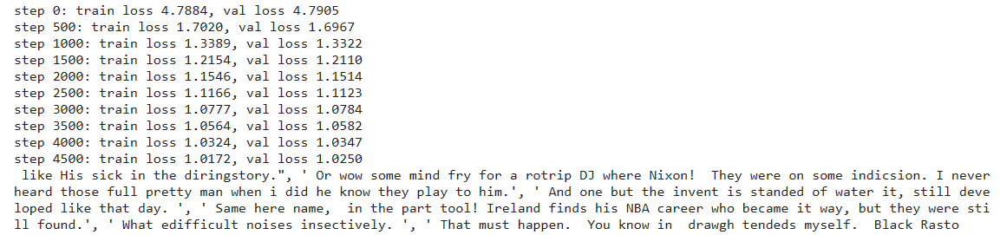

# Chatbot

This project is an AI chatbot developed with Python using the bigram learning model followed by a self-attention transformer model, following [this tutorial](https://youtu.be/kCc8FmEb1nY?si=U23EW0zKkTpJCBUD) using  [different data](human_chat.txt). The model is implemented into the Handler One Discord Bot project [here](https://github.com/3r1cZ/Handler-One).

## Contents
* [Model Hyperparameters](#current-model-hyperparameters)
* [Things Learned](#things-learned)
* [Preview](#preview)

## Current Model Hyperparameters
* Batch Size: 128
* Block Size: 256
* Maximum Iterators: 5000
* Evaluation Interval: 500
* Learning Rate: 3e-4
* Evaluation Iterators: 200
* Number of Embeds: 384
* Number of Heads: 6
* Number of Layers: 6
* Dropout Rate: 0.3

## Things Learned
* How to use Jupyter Notebook
* How to use the PyTorch framework to organize and generate data
* How to develop very simple machine learning algorithms such as the bigram learning model
* How to develop a transformer model using the self-attention mechanism

## Preview
This section contains an example output after training with the current model hyperparameters in [this section.](#current-model-hyperparameters)

